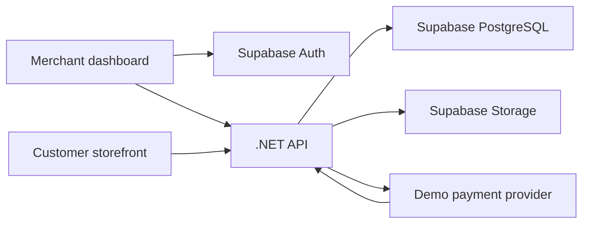

# Store Builder - project brief and learning guide

### Confirmed project notes — 2026-10-04

- Prioritize StoreCraft; defer Invoice Reminder. BoardSync uses Neon and Render, and no Supabase projects have been created yet.
- View store opens a separate browser tab.
- The merchant page builder uses predefined widgets that form the customer-facing storefront. Customer browsing and merchant editing are separate experiences.
- Checkout must include clearly labeled test payments. Start with the app-owned simulator; a provider sandbox is optional.
- Plan a later OMS connection for order sync, delivery, and in-store pickup. This is future scope, not completed functionality.
- Implementation progress and setup instructions are in README.md and docs/milestone-2-foundation.md. The original milestones below remain the scope reference.

Prepared for Kean Ombion. This document can be copied into a new project folder and used as the starting brief in a new chat.

## 1. What we are building

A small e-commerce platform with two connected experiences:

- **Merchant dashboard:** the seller signs in, manages products and orders, sets shipping rules, and designs a storefront.
- **Customer storefront:** a visitor browses published products, adds items to a cart, checks out using demo payments, and sees an order confirmation.

The dashboard should feel familiar to someone who has used Shopify or BigCommerce: a left sidebar, clear page titles, search and filters, product and order tables, practical forms, and a visual storefront editor. Use our own name, colors, components, and copy. The storefront should look like an actual shop, with product photography, readable prices, and a responsive layout.

The goal is a working portfolio demonstration you can explain and maintain. Your e-commerce experience should guide the product decisions. We will build it in small steps and make sure you understand each part before adding another.

**Working name:** Store Builder. Choose a final name later.

**Scope:** one store per merchant account, with support for several independent merchant accounts. Each store has its own products, settings, pages, and orders. Guest checkout; no customer account required in the first version.

## 2. What counts as a finished demo

A merchant can add a product, change shipping, arrange storefront sections, preview the changes, and publish. A customer can open that store, add the product to a cart, select shipping, complete a demo checkout, and receive an order reference. The merchant can find that order and record its fulfillment status.

Every main navigation item must lead to a useful screen. Buttons need working behavior or a clear explanation of what is unavailable. Data should persist for signed-in merchants. Use fictional customer details and conspicuous demo-payment labels.

## 3. The stack and the job of each tool

| Part | Choice | Plain-language explanation | Why we chose it |
| --- | --- | --- | --- |
| Dashboard and storefront | Next.js + React + TypeScript | Builds the pages people use. TypeScript catches many mistakes before the app runs. | Builds on your existing React experience and supports public product pages. |
| Styles and UI | Tailwind CSS; accessible components as needed | Keeps spacing, colors, forms, and layouts consistent. | Good for a polished commerce dashboard without building every low-level control ourselves. |
| API | ASP.NET Core on a supported .NET LTS release | Receives requests, checks permissions, applies business rules, and saves results. | Lets you practice the backend skills you are developing through BoardSync. |
| Database access | EF Core + Npgsql | Connects .NET to PostgreSQL and tracks schema changes through migrations. | Helpful for relationships and transactions; read and understand the SQL it produces. |
| Database | Supabase PostgreSQL | Stores products, stores, orders, and page designs. | Standard PostgreSQL plus supporting services. Supabase is our choice instead of Neon for this project. |
| Merchant login | Supabase Auth | Signs merchants in and gives the API evidence of their identity. | We can focus on store permissions rather than implement a password system. |
| Product images | Supabase Storage | Stores image files outside the API server. | Uploaded files survive deployments and API restarts. |
| Server data in dashboard | TanStack Query | Loads API data and refreshes it after changes. | Makes loading, failure, and mutation states easier to manage. |
| Forms | React Hook Form + Zod | Handles form inputs and gives useful validation messages. | Client validation helps the user; the API must still validate independently. |
| Builder state | React state/reducer first | Holds the current unsaved page design. | Start with one understandable state model. Add Zustand only if sharing editor state becomes difficult. |
| Reordering | dnd-kit, after verifying current compatibility | Helps move sections with pointer and keyboard interaction. | Dragging is useful, but also provide move-up/down buttons. |
| Payments | App-owned demo simulator first; optional Stripe sandbox integration | Simulates successful and failed checkout without charging anyone. | The demo can work even if a payment-provider account is unavailable. |
| Deployment | Netlify Free for Next.js; Render Free for the .NET API | Makes the app available online. | A small demo can fit free tiers, with limits described below. |
| Tests | xUnit for backend rules; Playwright for important browser journeys | Checks the behavior customers and merchants depend on. | Focus on prices, permissions, orders, and publishing. |

Choose compatible stable versions when scaffolding, pin them in manifests and lockfiles, and record them in the README. Read the installed Next.js version's bundled guidance before using its APIs. Avoid mixing tutorial code from different framework versions.

### How the pieces communicate



React presents information. The API decides what a merchant can change and what an order costs. PostgreSQL stores the results. Supabase supports the API; it does not replace the commerce rules we write.

## 4. Merchant dashboard screens

### Home

- Store name, link to the storefront, and setup checklist.
- Counts for products and orders; outstanding fulfillment work.
- Payment totals labeled as demo totals and grouped by the store's currency.
- Useful empty states that tell the merchant what to do next.

### Products

- Searchable product list with image, title, price, stock, and draft/active state.
- Add/edit product: title, slug, description, price, SKU, stock quantity, and images with alt text.
- Draft products stay out of the public storefront.
- Start with simple products. Sizes, colors, and variants are a later milestone.
- Archive products that have been ordered so historical orders still make sense.

### Orders

- Search/filter orders by reference, payment state, and fulfillment state.
- Detail screen: purchased items, saved prices, customer email, shipping address, shipping charge, totals, and timestamps.
- Track payment and fulfillment separately. A paid order can still be unfulfilled.
- Record a tracking number/URL when marking an order shipped. This is merchant-entered tracking, not a live carrier feed.
- Failed and pending demo payments must be visible; they are not successful sales.

### Storefront and page builder

- Theme settings for brand name, logo, accent color, and a small set of font choices.
- Left panel: ordered list of sections and add-section control.
- Center: preview of the storefront at desktop and phone widths.
- Right panel: settings for the selected section.
- Save draft, preview draft, and publish as distinct actions.
- Clear unsaved-change and save-failure feedback.

### Settings

- General: store name, unique storefront slug, contact email, and one currency per store.
- Shipping: supported country/region, flat rate, optional free-shipping threshold, and pickup if included in the milestone.
- Payments: show demo mode, test-payment controls, and optional provider connection status.
- No editable tax engine in the first release. State that tax calculation is outside this demo's scope rather than claiming it is handled.

## 5. Customer storefront screens

Use paths such as `/s/{storeSlug}` so several stores work without buying domains.

- Home: published page sections and active featured products.
- Catalog: product grid, basic search, and pagination.
- Product detail: images, description, price, stock state, and add-to-cart.
- Cart: change quantity, remove items, and see estimated totals.
- Checkout: guest details, eligible shipping option, authoritative total, and clear demo-payment action.
- Confirmation: order reference and current payment state. Provide secure access to this result; an easily guessed order number is not authorization.

If the API is waking up on free hosting, show a clear loading/retry state. Keep cart quantities in browser storage, but recheck everything on the server at checkout.

## 6. Page builder decisions

The first editor rearranges predefined sections. The merchant can add, edit, duplicate, remove, and reorder them. Start with:

1. Hero: title, short text, image, and button.
2. Featured products: choose active products.
3. Image and text: simple promotional content.
4. Announcement: short store message.
5. Footer: contact information and links.

Store the page as validated JSON: a schema version and an ordered array of section IDs, types, and allowed settings. Store references to products rather than copied product prices. Use the same rendering components for preview and published storefronts so they agree.

Keep a draft and an immutable published snapshot. Publishing creates a new snapshot and switches the public page to it; editing a draft does not change the live store. The server validates the full document before publication. Only public-safe fields belong in the storefront response.

Support plain text and constrained settings first. Arbitrary scripts, raw HTML, and unrestricted CSS are outside this editor. Publishing content should not let one merchant execute code in another person's browser.

**What you should be able to explain:** Why is this data rather than a generated code file? Why separate draft from published content? Why use the same renderer in preview and production?

## 7. Important commerce decisions

### Prices

Store amounts as integer minor units: for example, 1999 for a currency with two decimal places means 19.99. Support a small explicit set of currencies and their rules. The API reads prices from the database and calculates totals; the browser does not submit a trusted price.

Order items preserve the title, SKU, currency, and price at purchase time. Editing a product tomorrow must not rewrite yesterday's order.

### Shipping

Begin with one simple shipping region and flat-rate/free-threshold rules. Recalculate eligibility and price on the API. Reject unsupported destinations clearly. Live courier rates, shipping labels, and automatic delivery tracking come later.

### Inventory

Check stock at checkout using a database transaction. For simulated immediate payments, stock changes and order creation must remain consistent even if the customer double-clicks or retries. When adding asynchronous provider checkout, introduce expiring stock reservations and define how success, failure, and expiry release or consume them. Avoid selling the same final unit twice.

### Orders and payments

Example payment states: pending, paid, failed, refunded. Example fulfillment states: unfulfilled, shipped, delivered. Define allowed transitions; a refund record and a successful refund operation are different things.

Put payment behavior behind a small interface so the simulator can later be replaced by a provider integration. A simulator is visibly labeled and only works in demo deployments. Never let a browser call an unrestricted endpoint that marks arbitrary orders paid.

For Stripe sandbox integration, verify webhook signatures, handle delayed payments, record processed event IDs, and make repeated events safe. A success redirect alone is not payment confirmation. Provider choice and account eligibility must be checked before committing to a live integration. Multiple real merchants accepting payments would require a later platform-payment design, such as Stripe Connect.

## 8. Store ownership and permissions

Each merchant record belongs to a store. A store owner is identified by their verified Supabase user ID. Every merchant API request must check ownership of the store and requested resource. A merchant must not gain access by changing a product, order, or store ID.

The .NET API validates the token signature, issuer, audience, and expiry using the current Supabase signing-key guidance. A Supabase login does not automatically secure our custom API.

The browser uses our API for commerce data. A direct .NET database connection may bypass Supabase RLS depending on its role; do not assume RLS protects it automatically. Use explicit ownership checks, restricted database permissions, and integration tests. If implementing database RLS for the API, document how authenticated identity is passed safely per transaction.

Only intentionally public product imagery should be public in Storage. Order/customer information stays private. Validate file sizes, types, and store ownership for uploads. Keep database credentials, privileged Supabase keys, and payment secrets on the server.

## 9. Initial data model

| Entity | Purpose |
| --- | --- |
| Stores | Owner identity, name, slug, currency, settings, and published-page reference. |
| Products | Store-owned catalog records, prices, SKU, stock, and visibility. |
| Product images | Store/product association, storage path, order, and alt text. |
| Page drafts and published versions | Validated section documents and publishing history. |
| Shipping rules | Store-owned destination and charge settings. |
| Orders | Store, customer/address snapshot, totals, currency, and separate states. |
| Order items | Product reference plus purchased title, SKU, quantity, and price snapshots. |
| Payment attempts/events | Provider references, outcomes, and duplicate-event protection. |
| Inventory reservations | Introduced when payment becomes asynchronous. |

Use migrations committed to the repository. Prefer a single .NET application organized by feature: Stores, Products, Storefront, Shipping, Checkout, and Orders. This is a modular monolith: clear parts inside one deployable backend. It keeps development understandable and leaves room to grow.

Suggested repository layout:

```text
store-builder/
  apps/web/                 # Next.js dashboard and storefront
  apps/api/                 # ASP.NET Core application
  tests/                    # Backend integration and browser tests
  docs/                     # Decisions, learning notes, demo instructions
  README.md
```

## 10. Build milestones and learning checkpoints

### Milestone 1 - dashboard and storefront designs

Build the sidebar, products table, product form, order list, settings screens, and a storefront using fictional data. Create a small consistent design system. Make both experiences usable on a phone.

**Explain back:** What data does each screen need? Which components are shared? What should happen when a list is empty or a request fails?

### Milestone 2 - login, store ownership, and products

Connect Supabase Auth, build token validation in .NET, create migrations, and implement store/product APIs and persistent image uploads. Test two merchants with different stores.

**Explain back:** What proves who you are? What proves this product belongs to you? Where does that check happen?

### Milestone 3 - a real published storefront

Render active products from the API. Implement product details, cart, theme settings, and public store routes. Keep unpublished content private.

**Explain back:** Why does the API expose less information to a customer than to a merchant? Why can a cart's stored price become stale?

### Milestone 4 - storefront builder

Implement section editing, reordering, responsive preview, draft persistence, and publishing. Test that a saved draft has no effect on the public page until publication.

**Explain back:** Follow one change from the editor, through the API and database, to the published store. What fails safely if saving or publishing fails?

### Milestone 5 - shipping and demo orders

Implement authoritative totals, shipping rules, simulated checkout outcomes, inventory consistency, and order management. Add repeat-request protection.

**Explain back:** Why can we not trust a browser-submitted total? What happens if checkout is clicked twice? Why are payment and shipment separate states?

### Milestone 6 - optional provider sandbox

If an eligible account is available, integrate Stripe-hosted sandbox checkout and verified webhooks. Otherwise ship the clearly labeled simulator and document that provider integration is pending.

**Explain back:** Why can webhooks arrive twice or after the customer closes the browser? What proves a payment succeeded?

### Milestone 7 - polished public demo

Deploy, seed fictional products and orders, capture screenshots, write a short guided demo, and record a case study with decisions and known limitations. Exercise the full merchant-to-customer-to-order workflow.

**Explain back:** What can you demonstrate today? Which decisions would change for real merchants and higher traffic?

## 11. How we will work so you own the project

- Before each feature, explain its purpose, data flow, and one important tradeoff in plain language.
- Implement one small working slice, then explain the changed files and how to verify the behavior.
- Let you make or adjust a bounded part: one field, validation rule, section setting, query, or test.
- Ask you to explain the flow back and help correct gaps without turning it into an exam.
- Keep decision notes in `docs/decisions.md`: what we chose, why, and when to reconsider it.
- Prefer readable code and focused functions. Add abstractions when they solve a concrete repeated problem.
- End milestones with a working demo and a short learning note you can use during interviews.

You should eventually be able to trace: a merchant edits a price -> the API validates ownership -> the database saves it -> the public product response changes -> checkout reads the current price -> an order preserves the purchased price.

## 12. Tests that matter

- Merchant A cannot read or update merchant B's private data.
- A tampered cart price cannot change the server's total.
- Archived/draft products cannot be purchased.
- Shipping eligibility and thresholds behave correctly at their boundaries.
- Checkout retries do not create duplicate orders or consume stock twice.
- Two customers cannot buy the same final unit when stock is limited.
- Draft page changes stay private until published.
- A failed payment does not become a paid order; repeated provider events do not repeat effects.
- One browser test completes the product -> publish -> cart -> demo payment -> merchant order journey.

## 13. Public demo behavior

Provide a sample storefront anyone can browse. A guided merchant sandbox can let visitors try editing and previewing without altering another visitor's published store. Label temporary browser-only sandbox data clearly. Signed-in merchant accounts use real persistent app data.

Choose the sandbox/reset mechanism before exposing public write access. Avoid shared admin credentials and unlimited anonymous uploads. Seed a useful catalog and orders so the demo feels complete, even when nobody has added data yet.

## 14. The $0 demo budget

Free-tier hosting is our target, subject to usage and account limits. Use provider subdomains, a small catalog, compressed images, fictional data, and simulated/test payments. These choices remove the need for paid domains or real transaction fees.

- [Netlify pricing](https://www.netlify.com/pricing/): check the plan and shared account usage before deploying another site.
- [Render Free](https://render.com/docs/free): the API can sleep after inactivity; its local filesystem is temporary. Store persistent data and images in Supabase.
- [Supabase pricing](https://supabase.com/pricing) and [billing FAQ](https://supabase.com/docs/guides/platform/billing-faq): inspect existing projects first. The free account allowance includes only two active free projects, so BoardSync, Invoice Reminder, and this app cannot be assumed to each receive a separate free project. Plan the allocation before scaffolding; do not change another project's database casually.
- [Stripe testing](https://docs.stripe.com/testing): sandbox transactions do not move money. Live transactions have fees and separate eligibility requirements.

Record current quotas and decisions when implementation starts. Free-tier limits and providers can change. A real business launch needs a separate reliability and cost review.

## 15. Later features

After the core demo is reliable, consider product variants, discounts, refunds through a provider, transactional emails, carrier integrations, staff roles, custom domains, advanced reporting, and store subscriptions. Add each for a clear use case, with its own acceptance criteria.

## 16. Official references

- [Supabase Auth](https://supabase.com/docs/guides/auth)
- [Supabase signing keys](https://supabase.com/docs/guides/auth/signing-keys)
- [Supabase Storage](https://supabase.com/docs/guides/storage)
- [Stripe Checkout](https://docs.stripe.com/payments/checkout/quickstarts)
- [Stripe webhooks](https://docs.stripe.com/webhooks)
- [Stripe Connect](https://docs.stripe.com/connect)
- [EF Core documentation](https://learn.microsoft.com/en-us/ef/core/)
- [ASP.NET Core authentication](https://learn.microsoft.com/en-us/aspnet/core/security/authentication/)

## 17. Starting this in a new folder and chat

1. Create an empty project folder, for example `D:\Projects\StoreBuilder`.
2. Copy this file into that folder as `PROJECT_BRIEF.md`.
3. Open that folder as a new project/chat and attach or reference `PROJECT_BRIEF.md`.
4. Use this starting message:

> Read PROJECT_BRIEF.md and use it as the project brief. Help me build this Shopify/BigCommerce-inspired store-builder demo with Next.js, TypeScript, .NET, and Supabase. My budget is $0 for the learning demo. I want working merchant screens, a storefront, a section-based page builder, products, shipping settings, and orders with demo payments. First inspect the empty folder, confirm the free-service allocation, and begin Milestone 1 with a small working interface. Explain decisions and data flow in plain language before implementing each slice, then show me how to verify it and give me a bounded task so I learn and can own the work. Keep the brief, decisions, and README updated as we build. Do not claim planned features are complete.

The first deliverable is a navigable dashboard and sample storefront with mock data. Authentication, database wiring, and checkout follow in later milestones.
